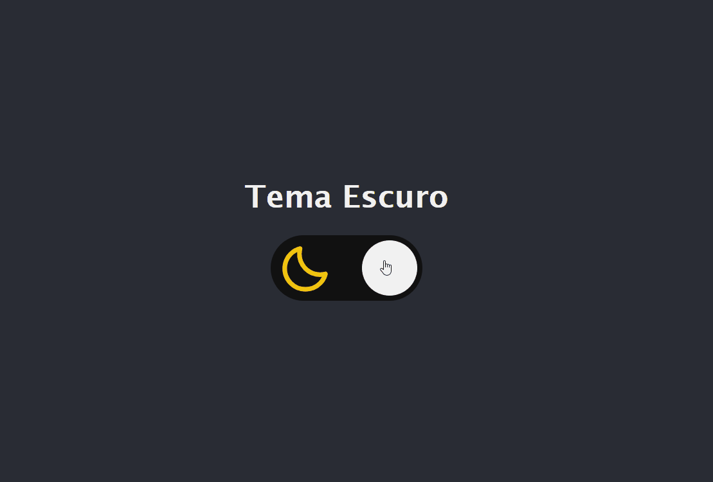

<h2 align="center">Theme Switcher</h2>

<h3 align="center">
  <a href="#-projeto">Projeto</a>&nbsp;|&nbsp;
  <a href="#-tecnologias">Tecnologias</a>&nbsp;|&nbsp;
  <a href="#licença">Licença</a>
</h3>

---

<!--  -->

## 🚀 Tecnologias

Esse projeto foi desenvolvido com as seguintes tecnologias:

- HTML e CSS
- JavaScript
- Git e Github
- Figma

## 💻 Projeto

A página contém um toggle para alternar entre o tema dark e light.

- [Acesse o projeto finalizado, online](https://juliaaoliveeirs.github.io/theme-switcher/)

## Licença

Esse projeto está sob a licença MIT. Veja o arquivo [LICENSE](LICENSE) para mais detalhes.
